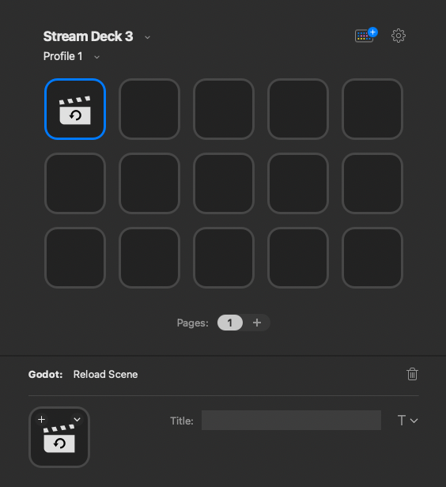

# Elgato Stream Deck Godot Plugin

Control your Godot applications with the Elgato Stream Deck! 

## Description

This repository contains both the plugin for the [Elgato Stream Deck](https://www.elgato.com/en/stream-deck-mk2) 
device and the [Godot engine](https://godotengine.org) so that both can communicate with each other. 
The plugins allow you to map any button on a compatible device to an action in your running Godot 
game/application. 

For example, if you are developing a game with lots of different scenes, it might be useful to quickly 
navigate between these scenes without using in-game debugging UI elements, and without writing code. Another example 
might be to invoke a specific play-state on the fly such as a winning/losing sequence.

## Getting Started

### Prerequisites

- Supported operating systems: MacOS, Windows
- Compatible Stream Deck device (XL / MK.2 / Mini)
- Stream Deck client software >=5.0
- Godot Engine >=4.0

### Installation

#### Stream Deck Plugin

Either double-click on the `games.boyne.godot.streamDeckPlugin` file to allow the Stream Deck client software to 
install it, or copy the `games.boyne.godot.sdPlugin` directory over to the Stream Deck plugins directory. 
On MacOS systems, it should be located under `~/Library/Application Support/com.elgato.StreamDeck/Plugins`, and for Windows,
`%appdata%/Elgato/StreamDeck/Plugins`. 

After copying, restart the Stream Deck client software to see the plugin listed in the main UI.

#### Godot Engine Plugin

To install the Godot plugin, simply copy the `godot-streamdeck-addon` directory to `res://addons` in your 
project filesystem. To enable it, navigate to `Project -> Project Settings -> Plugins` and click the `Enable`
checkbox on the plugin listing.

More on installing plugins in Godot can be found in the [official documentation](https://docs.godotengine.org/en/stable/tutorials/plugins/editor/installing_plugins.html). 

## Usage

Once both the Stream Deck and Godot Engine plugins are correctly installed and enabled, thee available actions
are ready for programming into the device from the Stream Deck client software:

#### Emit Signal

This action emits a signal to your running Godot application, and will be triggered on key up/down events. 
To connect this signal via GDScript, use the `ElgatoStreamDeck` autoload's `on_key_down` or `on_key_up` signals.

More usage on signals in Godot is available in their [official documentation](https://docs.godotengine.org/en/stable/getting_started/step_by_step/signals.html).

The `Emit Signal` action allows for an arbitrary string (`Signal Input`) to be passed into the function connected to the signal,
which could then be cast to other variants such as `int` or `float`, depending on your use case.

#### Switch Scene

This action switches the current playing scene in your Godot application to the one specified in the 
`Scene Path` field, which must be in a fully qualified path to the scene resource prefixed with `res://`. 

#### Reload Scene

This action reloads the current playing scene, which is useful for when you want to reset the scene quickly.

## Building from source

### Prerequisites

- Golang >=1.19
- Node >=16

### Building the binaries

The system-specific binaries for the Stream Deck plugin itself are built in Google's [Golang](https://go.dev/), and all of the application code is 
contained within a single `main.go` file. The binary is executed upon the launch of the Stream Deck client
software.

This simple application handles the Stream Deck [plugin registration](https://developer.elgato.com/documentation/stream-deck/sdk/registration-procedure/)
procedure and then opens a bridge to the Godot plugin and communicates over a WebSockets port for as long as the
client software is running. This port can be manually set in the [plugin.ini](./games.boyne.godot.sdPlugin/plugin.ini) 
file in the case of a clash. The default port is `8080` and the WebSockets endpoint runs over a local server on `http://127.0.0.1/ws`.

Some useful scripts for building the plugin is located in the `scripts` directory.

### Stream Deck SDK

The official [Stream Deck JavaScript SDK](https://github.com/elgatosf/streamdeck-javascript-sdk) is added as a submodule
in the plugin source, located in `games.boyne.godot.sdPlugin/lib/sdk`. This SDK is required for the property 
inspector to work correctly with the client software.

### Extending the plugin

To add more actions to the plugin, inspect the [actions-forms.json](./action-forms.json) file and add another entry and invoke the 
the `scripts/action-form-builder.js` script which produces a new  [property inspector](https://developer.elgato.com/documentation/stream-deck/sdk/property-inspector/) 
template for the Stream Deck client. Currently, only simple text fields are supported.

## Troubleshooting

When installing the plugin to the Stream Deck client, you may receive the warning below on Windows systems. 

Check the first box (allow access to private networks) and click `Allow access` for the plugin to function correctly. This warning stems from the 
WebSockets connection that the plugin opens, which allows for communication to the Godot plugin.

## Version History
* 1.0
    * Initial release

## License
This project is licenced under the MIT Licence - see the [LICENSE.md](./LICENCE.md) file for details.
